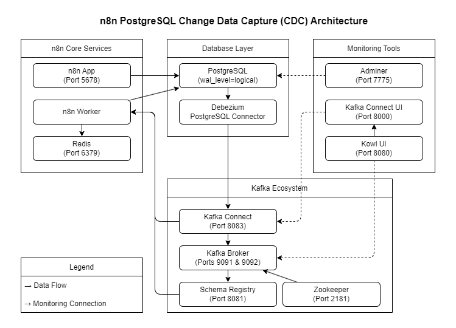
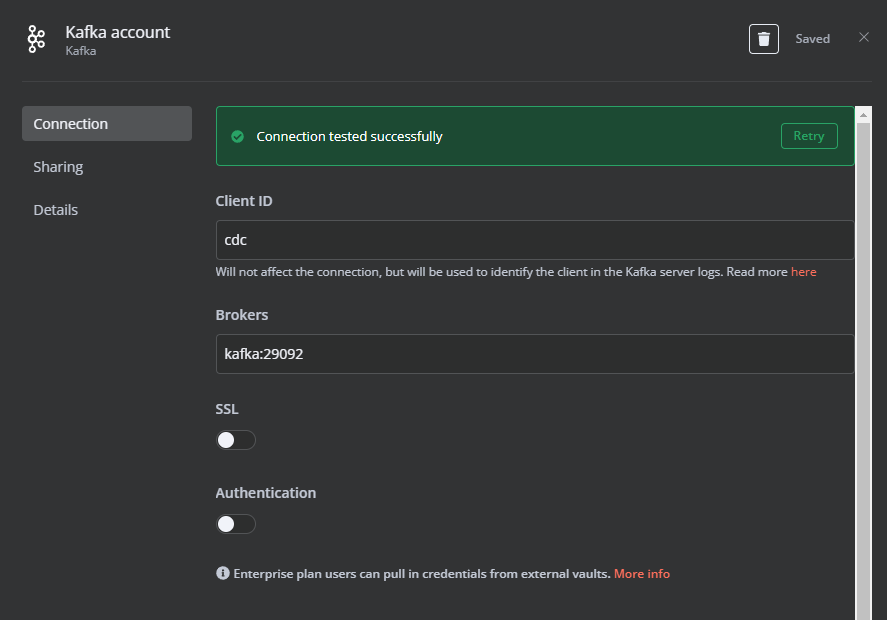
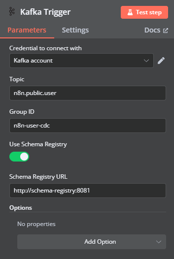

# n8n Change Data Capture (CDC) via Kafka

- Add support for Change Data Capture (CDC) over a core n8n database on postgres. 
- Forward database changes to using debezium to a Kafka stream via kafka-connect

Starts n8n with PostgreSQL as database, a Worker as a separate container.
Also initialises a kafka instance with a CDC stream monitoring a default n8n PostgreSQL database. Then configures a DBenzium connector to monitor the n8n database and forward changes to a Kafka topic.

## Architecture



Includes services and exposes ports for review of the solution, these should be hardened or removed for production. This includes:
  - Kowl UI (http://localhost:8080/)
  - Adminer (http://localhost:7775/)
  - Kafka Connect UI (http://localhost:8000/)

## Configuration

The default name of the database, user and password for PostgreSQL can be changed in the [`.env`](.env) file in the current directory.

## Start

To start n8n simply start docker-compose by executing the following
command in the current folder.

**IMPORTANT:** But before you do that change the default users and passwords in the [`.env`](.env) file!

```
docker-compose up -d
```

## Reviewing the CDC Topic content

The available Kafka Topics can be viewed using the local kowl instance: `http://localhost:8080/topics`.  Add and save a new n8n Workflow, then review the changes in http://localhost:8080/topics/n8n.public.workflow_entity.


By default; only the data **after** the change is provided, except in the case of delete operations where `before` is populated instead. To include the `before` field during update operations, the PostgreSQL table requires it's replica identity set to full, for example:
```
ALTER TABLE public.workflow_entity REPLICA IDENTITY FULL
```

Futher changes to Workflows will now include the `before` and `after` properties in the CDC messages.

## Consume from Kafka Topic in n8n Kafka Trigger

A Kafka Trigger can be used from n8n workflows to attach to the provided Kafka broker `kafka:29092` and Schema Registry URL `http://schema-registry:8081`.

### Create Kafka Connection:

For the first trigger you'll need to create a Kafka credential to work with:



N.B. SSL, Authentication and a pool of brokers should be configured for production.

### Create Kafka Trigger

Connect to the topic you want to work with `n8n.public.user` topic, this will allow us to observe changes tp this collection of data



In n8n a Topic is assigned to the Kafka Consumer Group with the first test of the Kafka Trigger occurrs. Any change to the assigned Topic will require changing the Group ID assigned to the trigger (and cleanup of the previous Consumer Group in Kafka).

#### Kafka Trigger CDC data sample

The CDC data generated in n8n will be an array of changes:
```
[
  {
    "message": {
      "before": null,
      "after": {
        "id": "ee796a0a-b913-448a-ab4a-314e859e006c",
        "email": "test@example.net",
        "firstName": "New user first name",
        "lastName": "New user surname name",
        // ... remainder of the PostgreSQL model
      },
      "source": {
        "version": "1.5.0.Final",
        "connector": "postgresql",
        "name": "n8n",
        "ts_ms": 1719449978446,
        "snapshot": "false",
        "db": "n8n",
        "sequence": "[\"29462448\",\"29462448\"]",
        "schema": "public",
        "table": "user",
        "txId": 850,
        "lsn": 29462448,
        "xmin": null
      },
      "op": "u",
      "ts_ms": 1719449978477,
      "transaction": null
    },
    "topic": "n8n.public.user"
  }
]
```

The operation performed is given by the `op` parameter. The provided values are:
* 'c' for inserts
* 'u' for updates
* 'd' for deletes


## Stop

To stop it execute:

```
docker-compose stop
```

## Cleanup

After the exercise clean up the stack and remove volumes:

```
docker-compose down -v
```

## References

- n8n with worker: https://github.com/n8n-io/n8n-hosting/tree/main/docker-compose/withPostgresAndWorker
- PostgreSQL CDC sample: https://github.com/rbiedrawa/cdc-postgres
- Debezium connector for PostgreSQL: https://debezium.io/documentation/reference/stable/connectors/postgresql.html

## Notes from exploration
- postgres needed to be started with `wal_level=logical` to support the logger used in [cdc-postgres](https://github.com/rbiedrawa/cdc-postgres) (from https://www.kineticedge.io/blog/cdc/)
- Supporting `before` and `after` in update CDC streams from postgres requires `replica identity full` to be assigned to the table:
    ```
    ALTER TABLE public.table_name REPLICA IDENTITY FULL
    ```

- remove services that aren't required
- remove port bindings that aren't required
- SSL and Authentication for Kinesis
